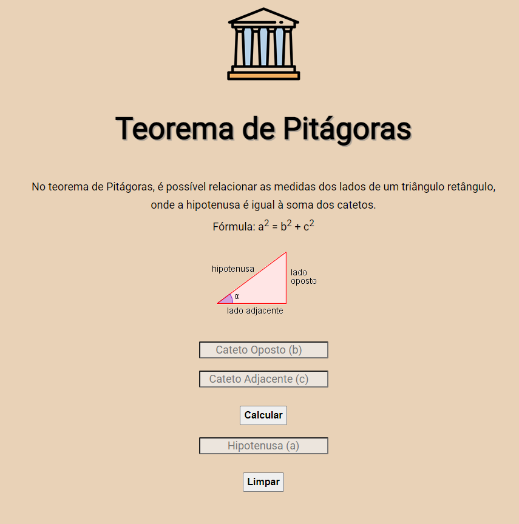

# Calculadora Teorema de Pitagoras 🧮

Calculadora para fórmula de Teorema de Pitágoras, feita em JS, HTML, CSS e Bootstrap.

Link para o site: https://gabimesquita.github.io/Teorema_de_Pitagoras/

<h2>Como usar?</h2>

1. Ao abrir a calculadora, temos os 3 campos abaixo para colocar os valores de cateto oposto e cateto adjacente.

2. Preencha ambos os campos e clique em Calcular, para obter o valor da hipotenusa.

3. O botão Limpar reinicia os campos para um novo cálculo.

<h2>Licença</h2>

MIT (Massachusetts Institute of Technology)

 
